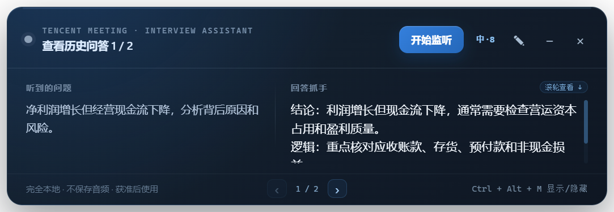
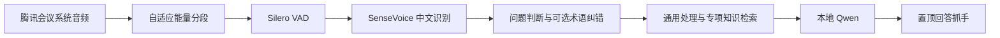

# 腾讯会议线上面试助手

一个面向 Windows 与腾讯会议/VooV Meeting 的完全本地、始终置顶的线上面试辅助小窗。它捕获系统回放音频，在本机完成中文语音识别、问题判断、知识检索、回答结构生成和历史问答翻阅，可用于行为题与通用技术题。

> 项目定位是通用的腾讯会议线上面试助手，并非仅限金融岗位。由于项目由金融专业学生发起并主导产品设计，因此对金融、会计、审计、估值和银行风险类面试做了针对性优化。开发过程使用 AI 编程工具辅助实现与测试。



## 为什么做这个项目

线上面试中的提问不一定以问号结尾，通用回答模型也常给出过长、难以在短时间内扫读的答案。本项目提供本地实时转写、问题判断和简短回答抓手，同时保留行为题与通用技术题的处理能力。

在金融会计场景中，语音识别还容易受到同音词、英文缩写和准则术语影响，例如“收付实现制”可能被识别成“收复实现制”。因此，本项目在通用能力之上增加了金融与会计专项优化：

- 中文优先的 SenseVoice 本地识别，并保留自动语言和 FP32 模式作为可选项；
- Silero VAD 静音过滤与较长问题停顿处理；
- 可编辑的金融/会计同音词纠错表；
- 覆盖三大报表、收入确认、营运资本、DCF/WACC、审计内控、金融工具和银行风险等主题的本地知识包；
- 对没有问号的陈述式要求进行判断，例如“解释两者区别并举例”或“分析背后的原因和风险”；
- 回答生成后启用答题保护，忽略疑似面试者回答、重复问题和回答内容回声；
- 在底部使用左右箭头翻阅本次运行中已经生成的历史问答；
- 技术题优先输出“结论 / 逻辑 / 注意”，行为题优先输出“核心 / 结构 / 落点”。

## 工作方式



整个推理链路只访问 `127.0.0.1`。原始音频在内存中处理，不写入文件，也不需要云端 API Key。

## 快速开始

### 环境要求

- Windows 10/11
- Node.js 20 或更新版本
- PowerShell
- 建议至少预留 15 GB 磁盘空间
- NVIDIA GPU 为推荐配置；语音识别运行在 CPU，本地回答模型可使用 GPU

### 安装

```powershell
git clone https://github.com/buluoai6-eng/tencent-meeting-online-interview-assistant.git
cd tencent-meeting-online-interview-assistant
npm install
powershell -ExecutionPolicy Bypass -File .\scripts\setup-local-models.ps1
npm start
```

模型和运行时默认部署到 `E:\TencentMeetingCoachLocal`。部署脚本会安装/下载 Ollama、Qwen、SenseVoice、Silero VAD 和独立 Python 运行环境，但这些第三方程序与模型文件不会进入本仓库。

### 便携版

GitHub Releases 提供可选的 Windows 便携 EXE。它由对应标签的公开源码构建，但没有商业代码签名，首次运行可能触发 Windows SmartScreen。便携版不包含模型，仍须先下载 Release 中的 `setup-local-models.ps1` 并执行：

```powershell
powershell -ExecutionPolicy Bypass -File .\setup-local-models.ps1
```

完成模型部署后再运行 `TencentMeetingCoach-Local-0.3.3-portable.exe`。下载后请使用 Release 附带的 `SHA256SUMS.txt` 核对文件完整性。

### 使用

1. 打开腾讯会议，确认面试官声音从 Windows 默认播放设备输出。
2. 点击铅笔按钮填写目标岗位、准则口径和真实经历。
3. 默认保留顶部识别设置“中文优先 / 速度 INT8 / 财会术语纠错”。
4. 点击“开始监听”，等待状态进入“监听中”。
5. 较长回答可在右侧区域使用鼠标滚轮查看；底部左右箭头可翻阅本次运行的历史问答。
6. `Ctrl+Alt+M` 显示或隐藏窗口。

应用只获得 Windows 回环音频，无法直接读取腾讯会议的说话人身份。为了减少把面试者回答当成新问题，首个提示生成后会进入答题保护：明确问句、明确指令和高置信度陈述式题目仍会触发；第一人称回答、重复问题和与上一提示高度相似的内容会被忽略。该机制属于文本级轮次判断，不等同于声纹识别。

财会纠错表位于：

```text
E:\TencentMeetingCoachLocal\config\finance-asr-corrections.json
```

可以添加公司名、产品名、岗位名及其常见误识别写法，保存后重启应用生效。

## 本机测试结果

- 7.19 秒带前后静音的中文样本经 VAD 裁为约 4.44 秒有效语音；
- INT8 的 VAD 加识别通常约 0.13–0.36 秒，取决于问题长度；
- FP32 在当前样本中未改善文字，且识别约慢 30%–40%，因此默认使用 INT8；
- Qwen3.5 9B 连续回答五道金融/会计题的生成中位数约 1.64 秒；
- 模型预热后，从面试官说完到提示出现通常约 2.8–3.2 秒。

不同硬件、会议音量、网络音频编码和问题长度会影响结果，上述数据仅代表开发机器的测试情况。

## 原创范围

本仓库公开的是项目原创部分，包括：

- Electron 窗口、系统音频回环与进程管理代码；
- 前后端音频分段和本地服务编排；
- 问题判断、提示词组织和回答格式逻辑；
- 金融/会计知识检索代码与知识条目；
- 财会术语纠错表；
- 界面设计、测试脚本和部署脚本。

本仓库源码不包含 SenseVoice、sherpa-onnx、Silero VAD、Ollama、Qwen 或 Electron 的源码与模型权重。可选的便携版 Release 会包含 Electron 运行时并保留其许可证；其余运行时和模型仍由部署脚本单独下载。所有第三方组件均受各自许可证约束，详见 [THIRD_PARTY_NOTICES.md](THIRD_PARTY_NOTICES.md)。

## 隐私、伦理与限制

- 应用不安装 Windows 读屏，不包含防检测或内容隐藏功能。
- 请只在面试方明确允许 AI 辅助、笔记工具或无障碍工具时使用。
- 不要把生成内容当作会计、审计、法律或投资意见；涉及具体准则时应核对当前 IFRS、中国企业会计准则或 US GAAP 原文。
- 应用不会虚构用户经历；面试准备信息应由用户填写真实内容。
- “腾讯会议”和相关标识属于其权利人。本项目为独立开源项目，与腾讯及所引用模型的开发者不存在隶属、授权或背书关系。

## 开发与测试

```powershell
npm run test:syntax
npm run test:questions
npm start
```

本地 ASR 与 Ollama 服务运行后，还可执行：

```powershell
npm run test:local
npm run benchmark:finance
```

## 许可证

本项目原创代码使用 [MIT License](LICENSE) 发布。第三方软件、模型和商标不在该授权范围内。
