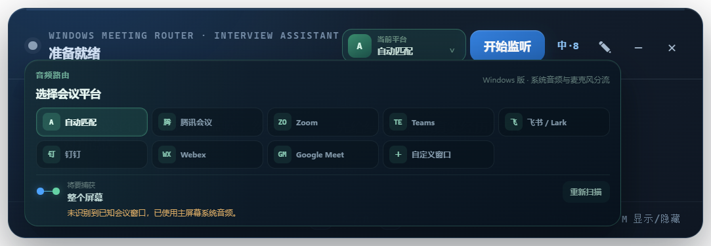
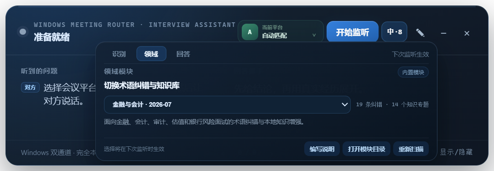
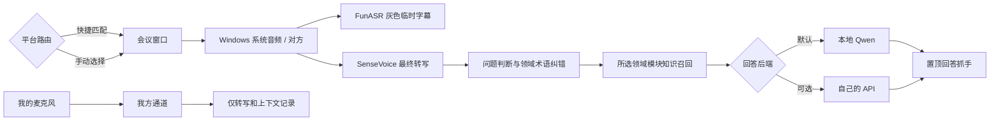
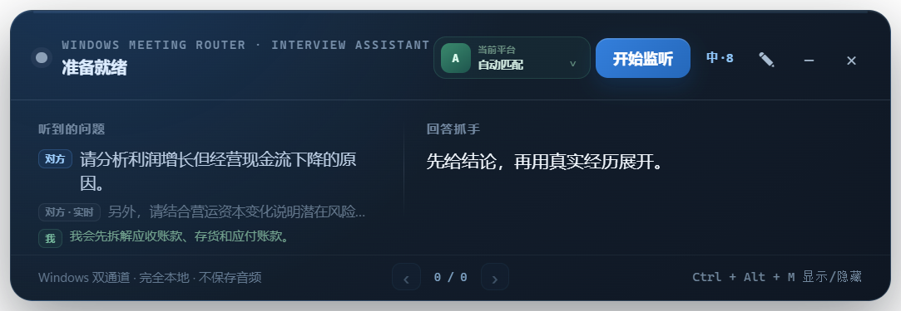

# 线上会议面试助手 · Windows

一个面向 Windows 主流视频会议平台的始终置顶线上面试辅助小窗。用户可以选择腾讯会议、Zoom、Microsoft Teams、飞书/Lark、钉钉、Webex、Google Meet，也可以手动选择任意窗口或屏幕。应用分别捕获 Windows 系统回放音频与用户麦克风，在本机完成中文流式字幕、最终转写、问题判断和知识检索，并可选择本地 Qwen 或自己的 API 生成回答抓手。术语纠错与专业知识以可切换的领域模块加载。

> 版本号：**1.0.0**。当前仅提供 Windows 版，可兼容 Windows 上的多种会议软件与浏览器会议窗口；暂不支持 macOS、Linux、Android 或 iOS。

> 项目定位是通用的线上面试助手，并非仅限金融岗位。由于项目由金融专业学生发起并主导产品设计，应用默认提供金融与会计模块，对会计、审计、估值和银行风险类面试做了针对性优化；用户也可以切换到通用模块或编写其他领域模块。开发过程使用 AI 编程工具辅助实现与测试。



## 为什么做这个项目

不同面试方使用的会议工具并不统一，而线上面试中的提问也不一定以问号结尾。1.0.0 将原先绑定单一会议软件的入口改造成 Windows 平台路由器：既能快捷匹配主流会议窗口，也能选择未适配的新平台或普通浏览器窗口。识别和回答层继续提供本地实时转写、问题判断和简短回答抓手。

在专业面试中，语音识别容易受到领域术语、英文缩写和同音词影响，例如“收付实现制”可能被识别成“收复实现制”。因此，本项目把专项优化做成可选择的领域模块：

- 中文优先的 SenseVoice 本地识别，并保留自动语言和 FP32 模式作为可选项；
- FunASR Paraformer 流式识别：对方尚未说完时约每 600ms 解码一次，并以灰色临时字幕显示；
- Silero VAD 静音过滤与较长问题停顿处理；
- 主流会议平台快捷匹配、自动识别和自定义窗口/屏幕选择；
- Windows 系统回环与麦克风采用两条独立采集链路，分别标记为“对方”和“我”；只有“对方”的最终转写可以触发回答；
- 每个领域模块可以同时携带术语纠错、知识条目和回答约束；
- 内置金融与会计模块包含 19 组术语纠错、52 个误识别别名和 14 个知识专题；
- 内置通用模块不加载专业纠错或知识，可用于普通行为题和通用岗位；
- 用户模块只包含本地 JSON，不执行代码，并经过格式、大小和目录边界校验；
- 对没有问号的陈述式要求进行判断，例如“解释两者区别并举例”或“分析背后的原因和风险”；
- 回答生成后启用答题保护，忽略疑似面试者回答、重复问题和回答内容回声；
- 在底部使用左右箭头翻阅本次运行中已经生成的历史问答；
- 技术题优先输出“结论 / 逻辑 / 注意”，行为题优先输出“核心 / 结构 / 落点”。

## Windows 平台路由

| 模式 | 行为 |
| --- | --- |
| 自动匹配 | 扫描已知会议窗口；识别到多个平台时选择窗口列表中的首个命中项，未命中时回退主屏幕 |
| 平台快捷项 | 分别匹配腾讯会议、Zoom、Microsoft Teams、飞书/Lark、钉钉、Webex 或 Google Meet；找不到时给出提示，不会选择无关窗口 |
| 自定义窗口 | 列出当前可见的 Windows 窗口和屏幕，适用于浏览器会议、尚未内置的平台或测试场景 |

平台选择会保存在本机，下次打开继续使用。窗口 ID 由 Windows 动态分配；自定义窗口重开后，应用会优先按窗口标题恢复，仍无法定位时要求用户重新选择。

## 领域模块

打开“设置 → 领域”即可选择模块。选择在下次开始监听时生效，同一模块中的术语纠错会同时作用于 FunASR 临时字幕和 SenseVoice 最终文本，知识条目则只在问题识别成功后按关键词召回。

用户模块目录可从应用内直接打开。首次打开时会自动放入完整说明和 `_template` 模板；也可以在仓库中阅读[领域模块编写指南](src/domain-modules/README.md)。一个模块通常包含：

```text
your-domain/
├─ module.json       # 名称、版本、说明和回答约束
├─ corrections.json  # 标准术语与常见误识别
└─ knowledge.json    # 关键词、知识摘要和维护来源
```

如果旧版 `E:\TencentMeetingCoachLocal\config\finance-asr-corrections.json` 与内置默认词表不同，1.0.0 会把它复制成用户模块“金融与会计（旧词表）”；原文件不会删除。

模块选择保存在本机。使用本地 Qwen 时模块知识不上传；使用自己的 API 时，被召回的模块知识会随题目一起发送到所选服务商。



## 工作方式



平台匹配使用 Electron 提供的 Windows 窗口列表：指定平台找不到窗口时不会静默选错；自动模式没有识别到已知会议窗口时才回退到主屏幕；自定义窗口失效后会要求重新选择。

默认的本地模式只访问 `127.0.0.1`，不需要云端 API Key。无论选择哪种回答后端，两路原始音频都只在内存与本地 FunASR/SenseVoice 服务中处理，不写入文件，也不会发送到回答 API。灰色临时字幕仅用于显示，只有 SenseVoice 最终文本会进入问题判断和回答流程。



### 本地模型与自己的 API

- **本地模型（默认）**：使用本机 Ollama/Qwen，题目、知识和准备信息均不上传；
- **自己的 API**：支持 OpenAI 及采用 Chat Completions 协议的兼容服务。用户自行填写 Base URL、模型名和 API Key；
- API Key 通过 Electron `safeStorage` 调用 Windows 系统加密能力保存，渲染界面只能获知“是否已保存”，不能读取明文；
- API 模式会把识别出的题目、召回的知识、最近对话和面试准备信息发送到用户填写的服务商，服务商的存储与使用规则以其隐私政策为准。

OpenAI 的 Base URL 可填写 `https://api.openai.com/v1`；兼容服务通常填写其 `/v1` 地址。程序会调用 `{Base URL}/chat/completions`，也接受直接填写完整的 `/chat/completions` 地址。远程地址必须使用 HTTPS，本机 `localhost` 接口可使用 HTTP。

## 快速开始

### 环境要求

- Windows 10/11
- Node.js 20 或更新版本
- PowerShell
- 建议至少预留 18 GB 磁盘空间
- NVIDIA GPU 为推荐配置；语音识别运行在 CPU，本地回答模型可使用 GPU

### 安装

```powershell
git clone https://github.com/buluoai6-eng/online-meeting-interview-assistant.git
cd online-meeting-interview-assistant
npm install
powershell -ExecutionPolicy Bypass -File .\scripts\setup-local-models.ps1
npm start
```

模型和运行时默认部署到 `E:\TencentMeetingCoachLocal`。部署脚本会安装/下载 Ollama、Qwen、SenseVoice、Silero VAD、FunASR Paraformer、CPU 版 PyTorch 和独立 Python 3.11 运行环境，但这些第三方程序与模型文件不会进入本仓库。FunASR 相关运行时、缓存和约 880 MB 的流式模型也会放在 E 盘目录。

### 便携版

GitHub Releases 提供可选的 Windows 便携 EXE。它由对应标签的公开源码构建，但没有商业代码签名，首次运行可能触发 Windows SmartScreen。便携版不包含模型，仍须把 Release 中的 `setup-local-models.ps1` 和 `download-funasr-model.py` 下载到同一目录，再执行：

```powershell
powershell -ExecutionPolicy Bypass -File .\setup-local-models.ps1
```

完成模型部署后再运行 `OnlineMeetingInterviewAssistant-Windows-1.0.0-portable.exe`。下载后请使用 Release 附带的 `SHA256SUMS.txt` 核对文件完整性。

### 使用

1. 打开要使用的会议软件或浏览器会议页面，确认对方声音从 Windows 默认播放设备输出。
2. 点击顶部绿色的平台按钮。可以选择具体平台、保留“自动匹配”，或选择“自定义窗口”后从列表中指定窗口/屏幕。
3. 点击铅笔按钮填写目标岗位、准则口径和真实经历。
4. 点击顶部的“中·8”设置按钮：在“领域”页选择金融与会计、通用或用户模块。
5. 在“识别”页可保留默认的“中文优先 / 速度 INT8 / 领域术语纠错 / 流式临时字幕 / 分离我的麦克风”。
6. 如需使用自己的 API，切到“回答”页，选择“自己的 API”，填写 Base URL、模型名和 API Key 后保存。Key 输入框留空会保留已经加密保存的 Key；点击“清除 Key”会删除 Key 并切回本地回答。
7. 点击“开始监听”，按 Windows 提示允许麦克风权限，等待状态显示平台名称、领域模块和“对方/我已分离”。如果拒绝麦克风权限，应用会自动继续使用仅系统音频模式。
8. 较长回答可在右侧区域使用鼠标滚轮查看；底部左右箭头可翻阅本次运行的历史问答。
9. `Ctrl+Alt+M` 显示或隐藏窗口。

应用不依赖任何会议软件的说话人标签，也不做声纹识别：Windows 系统回环音频固定归为“对方”，默认麦克风固定归为“我”。麦克风通道启用 Windows 回声消除、降噪和自动增益，并且在程序路由层被禁止触发回答；原有文本级答题保护仍作为系统音频串音、重复问题等情况的兜底。若使用扬声器且音量很大，麦克风仍可能收到少量对方声音，建议佩戴耳机以获得最稳定的归属结果。

需要特别说明：当前 Windows 回环捕获是**系统级音频**，选择某个会议窗口用于可靠匹配、状态标记和后续扩展，不等于操作系统只向应用提供该进程的声音。面试时应关闭音乐播放器、短视频和其他会发声的软件，避免它们进入“对方”通道。

用户领域模块默认位于：

```text
%APPDATA%\online-meeting-interview-assistant-windows\domain-modules
```

建议通过应用中的“打开模块目录”进入该位置。修改完成后回到“领域”页点击“重新扫描”，不需要重装本地模型。

## 本机测试结果

- 7.19 秒带前后静音的中文样本经 VAD 裁为约 4.44 秒有效语音；
- INT8 的 VAD 加识别通常约 0.13–0.36 秒，取决于问题长度；
- FP32 在当前样本中未改善文字，且识别约慢 30%–40%，因此默认使用 INT8；
- Qwen3.5 9B 连续回答五道金融/会计题的生成中位数约 2.0 秒；
- 流式 Paraformer 每约 600ms 解码一次，首条可读灰色字幕通常会在说话开始后约 1–2 秒出现；
- 本地模型预热后，从面试官说完到提示出现通常约 3 秒；API 模式还取决于网络和服务商响应速度。

不同硬件、会议音量、网络音频编码和问题长度会影响结果，上述数据仅代表开发机器的测试情况。

## 原创范围

本仓库公开的是项目原创部分，包括：

- Electron 窗口、系统音频回环与进程管理代码；
- Windows 会议平台识别、自定义窗口选择、目标失效保护和平台路由界面；
- 系统音频/麦克风双通道采集、说话人路由、前后端音频分段和本地服务编排；
- FunASR 流式临时字幕与 SenseVoice 最终定稿的双阶段识别流程；
- 领域模块发现、格式校验、运行时切换和用户模块目录；
- 问题判断、提示词组织和回答格式逻辑；
- 通用领域知识检索器，以及内置金融与会计模块；
- 界面设计、测试脚本和部署脚本。

本仓库源码不包含 FunASR、Paraformer、PyTorch、SenseVoice、sherpa-onnx、Silero VAD、Ollama、Qwen 或 Electron 的源码与模型权重。可选的便携版 Release 会包含 Electron 运行时并保留其许可证；其余运行时和模型仍由部署脚本单独下载。所有第三方组件均受各自许可证约束，详见 [THIRD_PARTY_NOTICES.md](THIRD_PARTY_NOTICES.md)。双音源与临时字幕的产品交互参考了 [MeetingCopilot](https://github.com/JWM0203/MeetingCopilot) 的公开效果，本项目的采集、HTTP 流式会话和回答路由代码按现有架构重新实现。

## 隐私、伦理与限制

- 应用不安装 Windows 读屏，不包含防检测或内容隐藏功能。
- 本地模式不会上传题目与准备信息；API 模式会把生成回答所需的文本发送到用户指定的接口，但不会上传原始音频。
- API Key 使用 Windows 系统加密后保存在应用数据目录，不进入仓库，也不会通过设置读取接口回传明文。请勿在截图、Issue 或日志中公开 Key。
- 请只在面试方明确允许 AI 辅助、笔记工具或无障碍工具时使用。
- 不要把生成内容当作会计、审计、法律或投资意见；涉及具体准则时应核对当前 IFRS、中国企业会计准则或 US GAAP 原文。
- 应用不会虚构用户经历；面试准备信息应由用户填写真实内容。
- 腾讯会议、Zoom、Microsoft Teams、飞书、Lark、钉钉、Webex、Google Meet 及相关标识属于各自权利人。本项目为独立开源项目，与这些平台及所引用模型的开发者不存在隶属、授权或背书关系。

## 开发与测试

```powershell
npm run test:syntax
npm run test:questions
npm start
```

本地 ASR 与 Ollama 服务运行后，还可执行：

```powershell
npm run test:local
npm run benchmark:finance
```

## 许可证

本项目原创代码使用 [MIT License](LICENSE) 发布。第三方软件、模型和商标不在该授权范围内。
